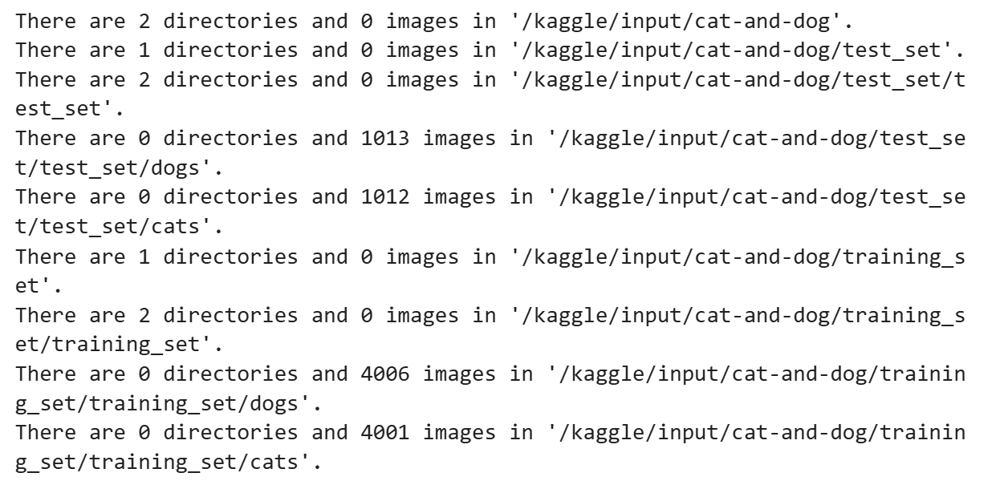
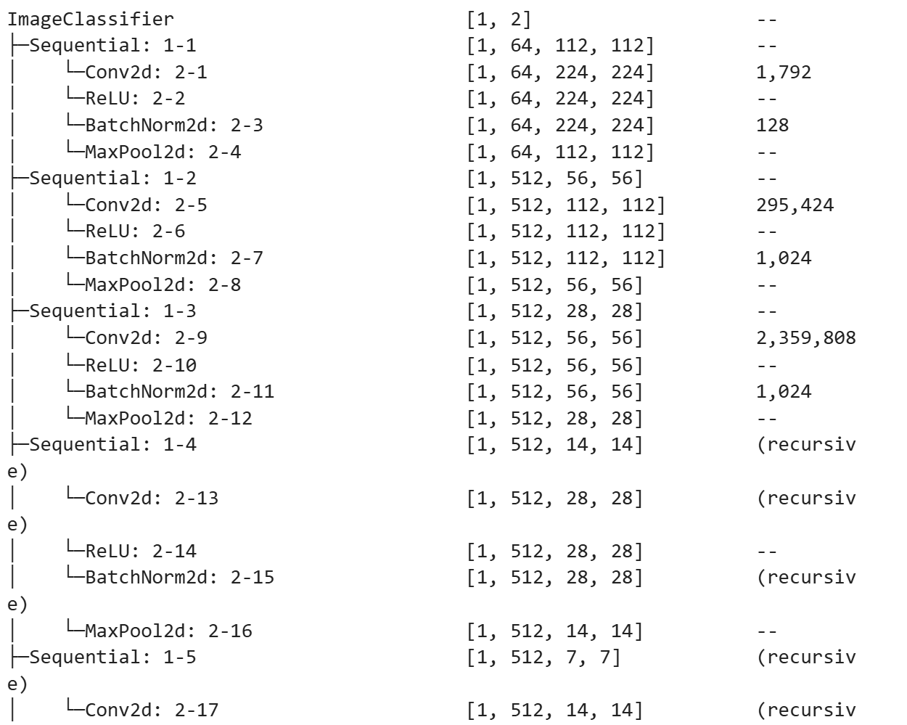
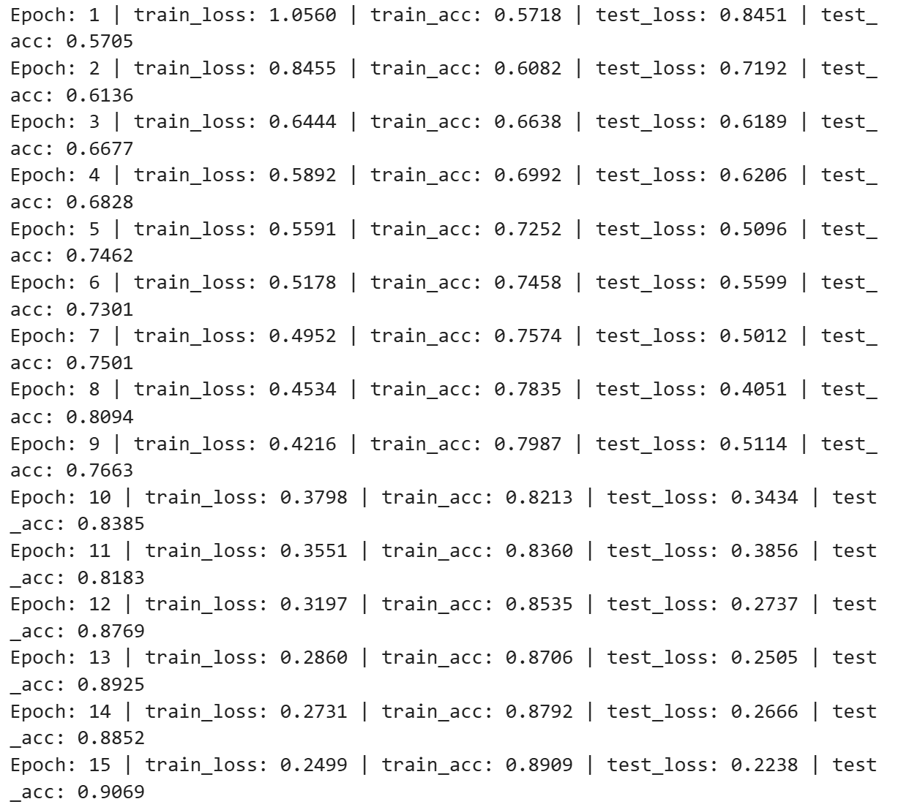
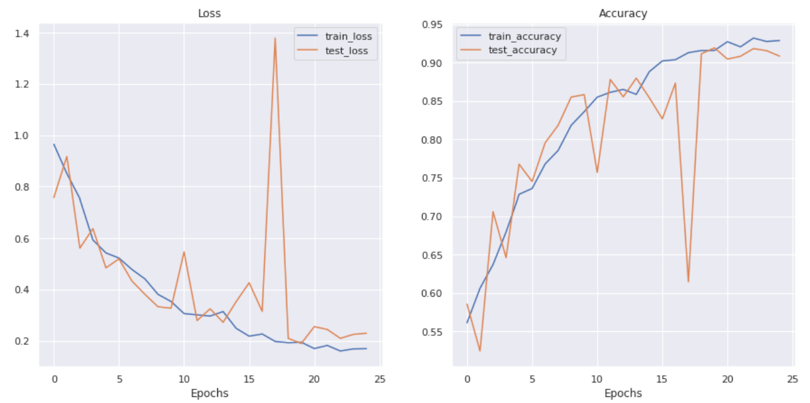
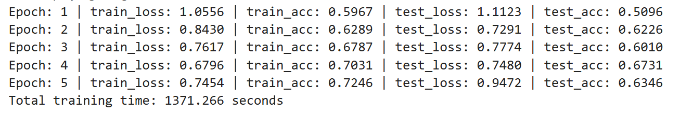
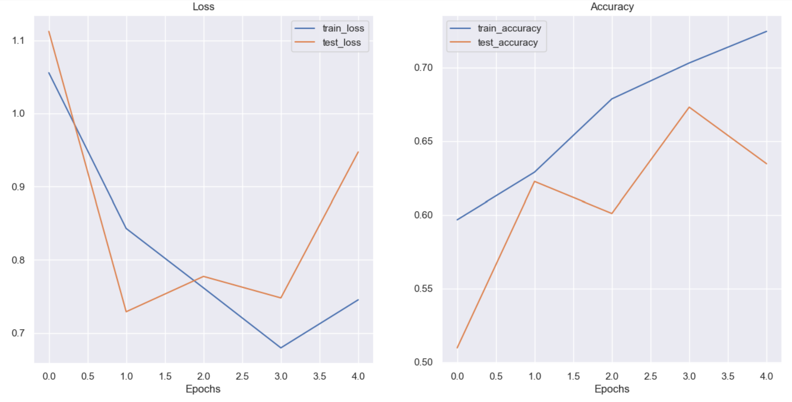
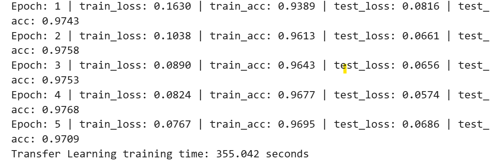
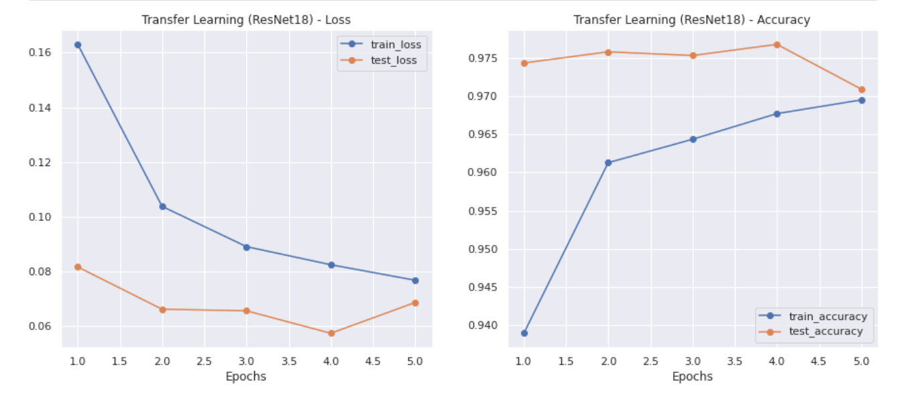
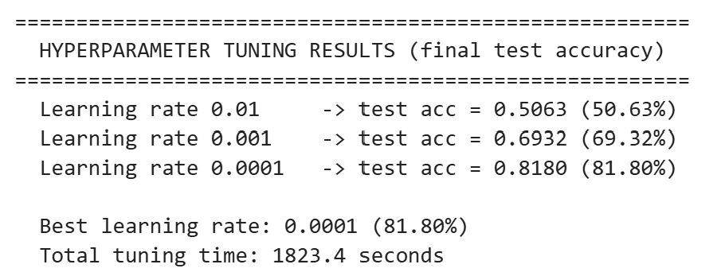
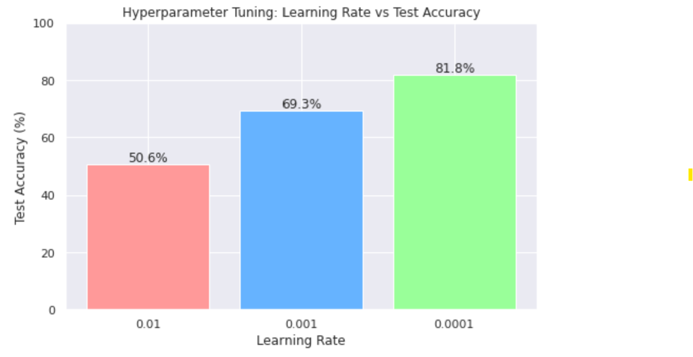

# Cats & Dogs Image Classification with PyTorch

**Author:** Mohamed Osman Abdullahi

**Student ID:** I202521131

A reproduction of the TirendazAcademy Kaggle notebook
[*"Cats & Dogs Classification with PyTorch"*](https://www.kaggle.com/code/tirendazacademy/cats-dogs-classification-with-pytorch).
This project builds a convolutional neural network (CNN) from scratch to classify images as **cat** or **dog**, documents the full pipeline (data loading → preprocessing → model → training → evaluation), and includes two optional extensions: **transfer learning** with ResNet18 and **hyperparameter tuning** of the learning rate.

---

## 1. Experiment Environment

The project was developed and verified on a local machine (CPU) and trained on the cloud (Kaggle GPU). Both environments are documented because the assignment asks for run instructions in each.

| Component | Local (own computer) | Cloud (Kaggle) |
|---|---|---|
| Where it runs | Personal laptop (Anaconda / Jupyter) | Kaggle Notebook (browser) |
| Operating system | Windows | Kaggle Linux server |
| Python | 3.10 (conda env `catsdogs`) | Pre-installed |
| PyTorch | **2.12.0+cpu** (CPU build) | **1.11.0** (GPU / CUDA build) |
| Processor / accelerator | AMD Ryzen 7 7840HS, 32 GB RAM | **NVIDIA T4 GPU** |
| Training device | `cpu` | `cuda` |
| Extra libraries | manually installed: `seaborn`, `tqdm`, `torchinfo` | pre-installed |

**Why two environments?** The local laptop has an AMD GPU, which is **not compatible with PyTorch's CUDA acceleration** (CUDA is NVIDIA-only). PyTorch therefore runs on the CPU locally, which is too slow for full training. The pipeline was verified locally on the CPU, while all heavy training was performed on Kaggle's NVIDIA T4 GPU. This is also why the local and cloud PyTorch versions differ.

---

## 2. How to Run the Code

There is one notebook for each environment. You only need to run **one** of them to reproduce the experiment; both contain the same pipeline, adapted to their environment.

### Option A — Run on the Cloud (Kaggle) — *recommended*

This is the environment used for all reported results.

1. Open `Notebooks/catsdogs_kaggle.ipynb` on Kaggle.
2. In the right-hand panel, set **Session options → Accelerator → GPU T4**, and turn **Internet ON** (the optional transfer-learning task downloads pre-trained weights).
3. Click **Run All**.
   - All libraries are pre-installed.
   - The dataset is already mounted at `/kaggle/input/cat-and-dog`.
4. The notebook runs top to bottom: data loading → preprocessing → model → training (25 epochs) → curves → evaluation → optional tasks.

### Option B — Run Locally with Anaconda (CPU)

This reproduces the CPU verification run.

1. Create and activate an environment:
   ```bash
   conda create -n catsdogs python=3.10
   conda activate catsdogs
   ```
2. Install the required libraries:
   ```bash
   pip install torch torchvision matplotlib numpy jupyter seaborn tqdm torchinfo
   ```
3. Download the **"Cat and Dog"** dataset from Kaggle
   ([tongpython/cat-and-dog](https://www.kaggle.com/datasets/tongpython/cat-and-dog))
   and extract it into the project folder.
4. In `Notebooks/catsdogs_local.ipynb`, set the dataset paths to your local folder (use **forward slashes**), for example:
   ```python
   image_path = "C:/Users/Mohamed Osman/Documents/catsdogs_project/archive"
   train_dir  = image_path + "/training_set/training_set"
   test_dir   = image_path + "/test_set/test_set"
   ```
5. Launch Jupyter and run the cells from top to bottom:
   ```bash
   jupyter notebook
   ```

> **Local notes.** Some libraries (`seaborn`, `tqdm`, `torchinfo`) must be installed manually because Kaggle provides them by default. Because local training runs on the CPU and is slow, the local notebook trains on a **random subset** of the data for **5 epochs** purely to prove the pipeline runs end-to-end. The full, high-accuracy training was done on Kaggle (see Section 6).

---

## 3. Dataset and Preprocessing

### Dataset

The Kaggle "Cat and Dog" dataset, with a roughly balanced split between the two classes:

| Split | Cats | Dogs | Total |
|---|---|---|---|
| Training | 4,001 | 4,006 | 8,007 |
| Test | 1,012 | 1,013 | 2,025 |
| **Total** | | | **10,032** |



                           *[FIGURE: dataset folder structure — the `walk_through_dir` output showing the image counts above]*

### Preprocessing pipeline (`torchvision.transforms`)

Every image passes through the same pipeline so the model receives fixed-size numerical inputs:

1. **Resize to 224 × 224** — all images become the same size. This 224×224 size is required by the model: after the convolutional blocks it produces a 3×3 feature map, and the final layer expects `512 × 3 × 3 = 4608` input features.
2. **RandomHorizontalFlip (p = 0.5)** — data augmentation; randomly mirrors images so the model sees more variety and is less likely to overfit (a mirrored cat is still a cat).
3. **ToTensor** — converts each image to a PyTorch tensor and scales pixel values from the 0–255 range down to 0.0–1.0.

---

## 4. Model Architecture

The from-scratch model, `ImageClassifier`, is a CNN made of repeated convolutional blocks followed by a classifier:

- **Convolutional blocks** — each block is `Conv2d → ReLU → BatchNorm2d → MaxPool2d`. The blocks progressively shrink the spatial size (224 → 112 → 56 → 28 → 14 → 7 → 3) while increasing depth (3 → 64 → 512 channels).
- **Classifier** — `Flatten → Linear(in_features = 4608, out_features = 2)`. The final layer outputs **2 values** (cat vs dog), since this is a binary classification task.

| Property | Value |
|---|---|
| Input shape | `[batch, 3, 224, 224]` |
| Total parameters | **2,668,418** |
| Trainable parameters | 2,668,418 |
| Output classes | 2 (cat, dog) |
| Estimated model size | ~199 MB |

The full layer-by-layer summary was generated with `torchinfo`.



                                       *[FIGURE: the `torchinfo` model summary table]*

---

## 5. Training Setup (from-scratch CNN)

| Setting | Local (verification) | Kaggle (full run) |
|---|---|---|
| Data | 1,000 train / 400 test (random subset) | full 8,007 / 2,025 |
| Epochs | 5 | 25 |
| Image size | 224 × 224 | 224 × 224 |
| Batch size | 32 | 32 |
| Loss function | CrossEntropyLoss | CrossEntropyLoss |
| Optimizer | Adam | Adam |
| Learning rate | 0.001 | 0.001 |
| Device | CPU | NVIDIA T4 GPU |
| Total training time | ~1,371 s (~22.9 min) | ~3,017 s (~50 min) |

---

## 6. Results — Reproduced Experiment Summary

This section covers the four items the assignment requires: data preprocessing (Section 3), model architecture (Section 4), training curves, and test-set performance.

### 6.1 Cloud (Kaggle) — main result

The full 25-epoch run on the GPU is the primary result.



                                        *[FIGURE: Kaggle training output — the 25 epoch lines and total training time]*



                                       *[FIGURE: Kaggle loss and accuracy curves]*

| Metric | Epoch 1 (start) | Epoch 25 (final) | Best |
|---|---|---|---|
| Train accuracy | 57.2% | 92.5% | — |
| Test accuracy | 57.1% | **88.2%** | **92.3%** (epoch 23) |
| Train loss | 1.056 | 0.177 | — |
| Test loss | 0.845 | 0.337 | — |

**Analysis.**
- Test accuracy rose from ~57% (close to random guessing for two classes) to a peak of **~92%**, finishing at **~88%** in the final epoch. The model clearly learned to distinguish cats from dogs on unseen images.
- Training accuracy (92.5%) and the best test accuracy (92.3%) stayed close, indicating the model generalized well rather than simply memorizing the training images (minimal overfitting).
- Training loss fell steadily from 1.056 to 0.177, confirming effective learning over the epochs.
- A brief instability appears around **epoch 17–18**, where test loss spiked (to ~1.38) and test accuracy dropped (to ~61%) for a single epoch before recovering. Such short-lived fluctuations are normal in mini-batch training, and the model stabilized again immediately afterwards.

### 6.2 Local (Anaconda, CPU) — pipeline verification

To document the "local vs cloud" requirement, the same pipeline was run locally on the CPU using a small random subset (1,000 train / 400 test) for 5 epochs. The purpose was to **prove the pipeline runs locally**, not to reach high accuracy.



                                             *[FIGURE: local training output — 5 epochs and total time]*



                                             *[FIGURE: local loss and accuracy curves]*

| Metric | Epoch 1 | Epoch 5 (final) |
|---|---|---|
| Train accuracy | 59.7% | 72.5% |
| Test accuracy | 51.0% | 63.5% |

**Analysis.** Test accuracy climbed from ~51% to ~63.5% across only 5 epochs on 1,000 images, showing the model is genuinely learning even in this short CPU run. The lower accuracy compared with Kaggle is expected: far fewer images and far fewer epochs. This run confirms the code is correct and reproducible locally; the high-accuracy result comes from the full GPU run.

### 6.3 Local vs Cloud comparison

| | Local (CPU) | Cloud (Kaggle GPU) |
|---|---|---|
| Data | 1,000 / 400 subset | full 8,007 / 2,025 |
| Epochs | 5 | 25 |
| Time | ~22.9 min | ~50 min |
| Final test accuracy | ~63.5% | ~88% (peak ~92%) |

The comparison illustrates why a GPU and the full dataset matter: with more data and more epochs (only feasible in reasonable time on the GPU), the same model reaches far higher accuracy.

---

## 7. Optional Tasks

Both optional extensions were completed on Kaggle (GPU). Each is added as a separate, clearly labelled section at the end of `catsdogs_kaggle.ipynb`.

### 7.1 Transfer Learning — ResNet18

Instead of training a CNN from scratch, a **ResNet18** model pre-trained on ImageNet was used. The approach:

1. Load pre-trained ResNet18.
2. **Freeze** all pre-trained layers (keep their learned features).
3. **Replace the final fully-connected layer** with `Linear(512 → 2)` for the cat/dog task.
4. Train **only the new final layer** for 5 epochs.

Because ResNet18 expects ImageNet-style inputs, the transforms for this task additionally apply standard **ImageNet normalization** (mean `[0.485, 0.456, 0.406]`, std `[0.229, 0.224, 0.225]`).



                                            *[FIGURE: transfer learning training output — 5 epochs and total time]*



                                            *[FIGURE: transfer learning loss and accuracy curves]*

| Metric | Epoch 1 | Epoch 5 (final) | Best |
|---|---|---|---|
| Train accuracy | 93.9% | 97.0% | — |
| Test accuracy | 97.4% | 97.1% | **97.7%** (epoch 4) |
| Training time | | ~355 s (~6 min) | |

**Analysis.** Transfer learning reached **~97% test accuracy in only 5 epochs and ~6 minutes**, beating the from-scratch CNN (~92% peak in 25 epochs and ~50 minutes) on both accuracy and speed. It even achieved ~97% test accuracy on the very first epoch, because ResNet18 already learned to recognize general image features from millions of ImageNet images and only needed to learn the final cat/dog decision. Interestingly, test accuracy is slightly higher than train accuracy here; this is expected because the training images use random-flip augmentation (making training slightly harder) while the test images do not, and the pre-trained model generalizes very well.

### 7.2 Hyperparameter Tuning — Learning Rate

The from-scratch CNN was trained for 5 epochs at three different learning rates (with a fresh copy of the model each time) to study the effect of the learning rate. The final test accuracy of each run was compared.



                                           *[FIGURE: hyperparameter tuning results — the three accuracies and the chosen best]*



                                           *[FIGURE: hyperparameter tuning bar chart]*

| Learning rate | Final test accuracy (5 epochs) |
|---|---|
| 0.01 | 50.6% |
| 0.001 | 69.3% |
| 0.0001 | **81.8%** (best over 5 epochs) |

Total tuning time: ~1,823 s (~30 min).

**Analysis.** The learning rate had a large effect on performance:
- **0.01 was too high** — the model failed to settle and scored ~50.6%, essentially random guessing for two classes.
- **0.0001 was the most stable** over this short 5-epoch comparison and gave the best final-epoch accuracy (81.8%).
- This does **not** contradict the main run, which used `lr = 0.001` over 25 epochs to reach ~92%. The comparison here uses only the final epoch's accuracy over 5 short epochs, which is noisier; over many more epochs, `lr = 0.001` converges to higher accuracy. The key takeaway is that choosing an appropriate learning rate is critical — too large a value can prevent learning entirely.

---

## 8. Project Structure and Execution Order

```
catsdogs_submission/
├── README.md                              # this file
├── Notebooks/
│   ├── catsdogs_kaggle.ipynb              # main notebook: full GPU run + both optional tasks
│   └── catsdogs_local.ipynb               # local CPU verification run (subset)
└── Results/
    ├── kaggle/
    │   ├── kaggle_dataset_structure.png   # image counts per folder
    │   ├── kaggle_device_cuda.png         # device = 'cuda'
    │   ├── kaggle_model_summary.png       # torchinfo architecture table
    │   ├── kaggle_training_output.png     # 25-epoch training log
    │   └── kaggle_curves.png              # loss & accuracy curves
    ├── local/
    │   ├── local_device_cpu.png           # device = 'cpu'
    │   ├── local_training_output.png      # 5-epoch training log
    │   └── local_curves.png               # loss & accuracy curves
    └── optional/
        ├── transfer_learning_output.png   # ResNet18 training log
        ├── transfer_learning_curves.png   # ResNet18 curves
        ├── hyperparameter_results.png     # learning-rate comparison text
        └── hyperparameter_barchart.png    # learning-rate bar chart
```

**How to reproduce / order of execution:**

1. **Main experiment + optional tasks** — open `Notebooks/catsdogs_kaggle.ipynb` on Kaggle (GPU + Internet on) and click **Run All**. It executes in order: imports → device check → dataset structure → transforms → data loaders → model definition → `torchinfo` summary → training (25 epochs) → curves → evaluation → Optional Task 1 (Transfer Learning) → Optional Task 2 (Hyperparameter Tuning).
2. **Local verification (optional to re-run)** — open `Notebooks/catsdogs_local.ipynb` in Jupyter, update the dataset paths (Section 2, Option B), and run the cells top to bottom.

Both notebooks are runnable without modification, except for the local dataset path, which must point to where you extracted the dataset.

---

## 9. Summary

A CNN was built from scratch in PyTorch and trained to classify cats vs dogs, reproducing the reference Kaggle notebook. The pipeline was verified locally on a CPU and trained fully on a Kaggle GPU, reaching about **92% peak test accuracy** (~88% at the final epoch). Two optional extensions were completed: **transfer learning with ResNet18** reached **~97% test accuracy** in only 6 minutes, clearly outperforming the from-scratch model, and a **learning-rate hyperparameter study** showed how strongly this single setting affects performance. All preprocessing steps, the model architecture, training curves, and test-set performance are documented above, satisfying the requirements of the assignment.
